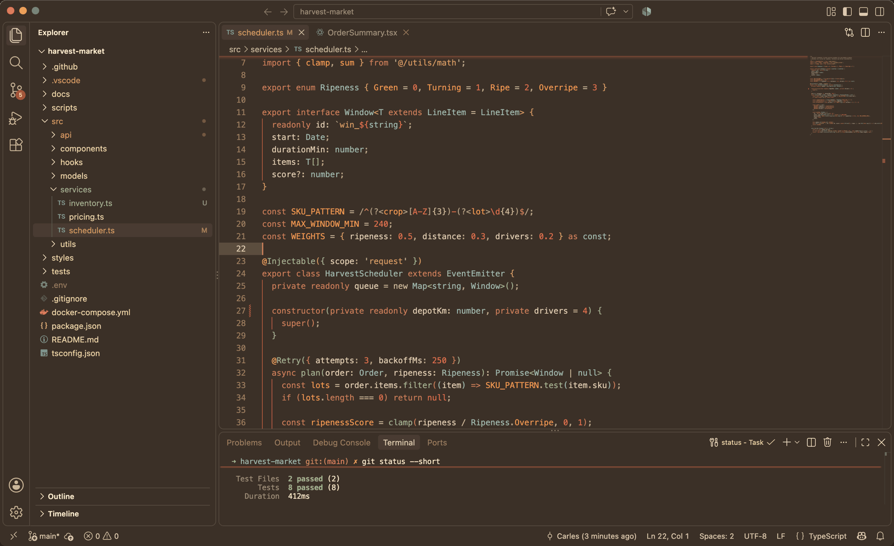

# Autumn Serenity Theme

A dark theme for Visual Studio Code inspired by the calming hues of autumn: warm, earthy tones that reduce eye strain and create a soothing coding environment.

> **🍂 It's September, and that means Autumn Serenity is back.** The theme has been rebuilt from the ground up: a new accessible palette, richer syntax highlighting, full terminal and bracket colours, and a redesigned icon. This is an actively maintained theme and more updates are on the way. Give it a try and [let me know what you think](https://github.com/CarlesBusquetsDev/autumn-serenity-theme/issues) — every bit of feedback helps shape the next release.



## Features

- **Warm autumn palette** — oranges, reds and browns of fall leaves.
- **Balanced contrast** — clear readability on a soft dark background.
- **Focused syntax highlighting** — colours chosen to emphasise structure without overwhelming your eyes.
- **Works everywhere** — JavaScript, TypeScript, Python, HTML, CSS, Markdown and more.

## Installation

1. Open Visual Studio Code.
2. Go to the Extensions sidebar (`Ctrl+Shift+X` / `Cmd+Shift+X`).
3. Search for **Autumn Serenity** and click **Install**.
4. Open the Command Palette (`Ctrl+Shift+P` / `Cmd+Shift+P`), run **Preferences: Color Theme** and pick **Autumn Serenity Theme**.

## Development

The theme JSON is **generated** — do not edit `themes/autumn-serenity-theme.json` by hand.

```
src/palette.js   named colours (single source of truth)
src/theme.js     workbench + token colours, written with palette names
scripts/build.js generates themes/autumn-serenity-theme.json
```

```bash
npm install            # once
npm run build          # regenerate the theme JSON
npm run check          # verify the JSON is in sync with src/ (use in CI)
npm run package        # build a .vsix into dist/
npm run install:local  # package and install into your VS Code
npm run publish        # publish to the Marketplace (needs a vsce token)
```

To see changes live while editing, press `F5` in this repo: VS Code opens an Extension Development Host that reloads the theme every time the JSON is rebuilt.

## What's new in 1.1.0

- New primary accent (pumpkin `#d97757`) everywhere VS Code used to fall back to blue.
- Two cool counterpoints fern green for functions, lichen for types — so code has real tonal variety.
- Every text colour now meets WCAG AA contrast on the editor background.
- Full 16-colour terminal palette, six-level bracket pair colours, complete git decorations.
- 28 syntax rules (was 13) plus semantic token colours for TypeScript, Python, Rust and more.

See the [CHANGELOG](CHANGELOG.md) for the full list.

## Feedback and contributions

I'm actively working on this theme and will keep shipping updates. If something looks off in your language or setup, or you have an idea, please [open an issue](https://github.com/CarlesBusquetsDev/autumn-serenity-theme/issues) — screenshots are especially welcome. Pull requests are welcome too. And if you enjoy the theme, a rating on the Marketplace goes a long way.

Enjoy coding with the warmth and serenity of autumn! 🍂
